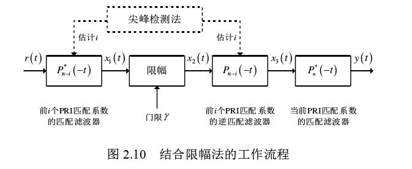
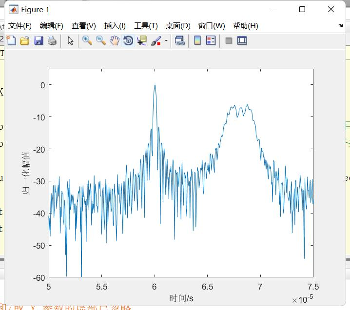
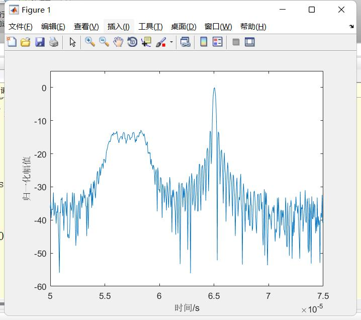
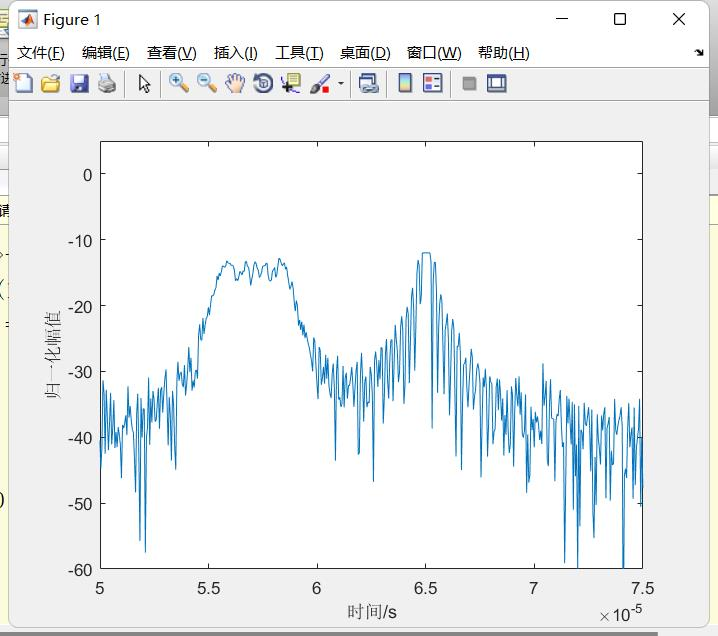
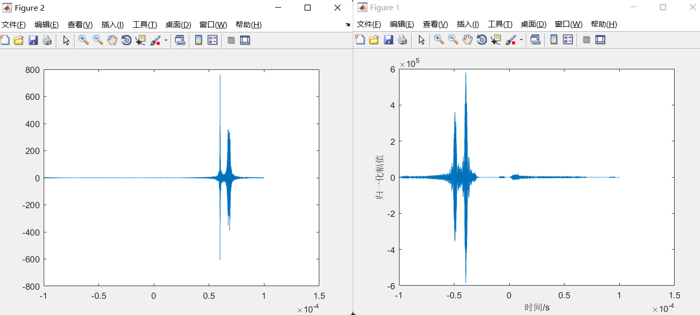

# 本周工作

## 时间：2023.1.2-1.13

## 仿真实验

* 斜变-随机脉冲初始相位信号（SV-RPIP）自相关和互相关
***

***
* 限幅法工作流程
***

***
* SV-RPIP信号匹配滤波结果
***

***
* 接受信号以干扰信号为匹配系数的匹配滤波结果
***

***
* 限幅后的输出结果
***

***
* 问题
* ***

***
