# 本周任务

## 时间：11.21-11.27

## 1.仿真实验

* 无干扰时雷达采用不同检测处理检测概率随距离变化

  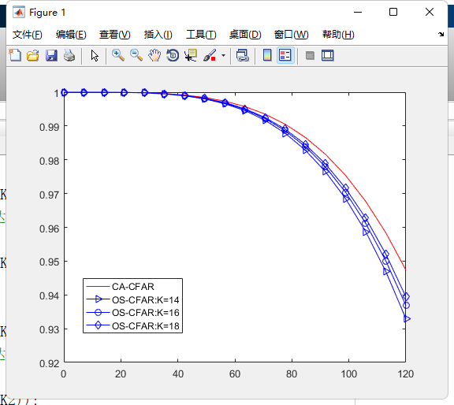

### 协同干扰对检测器性能影响

* 干燥比：

  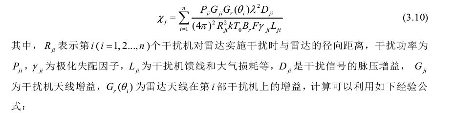

### 不同干扰方式的脉压增益计算方式如下

	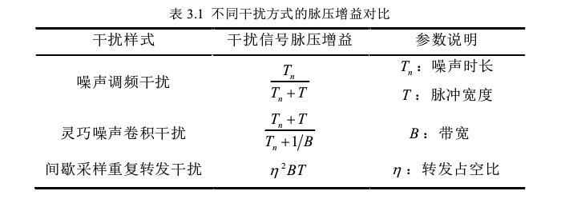

* 噪声调频功率协同干扰

  

* 灵巧噪声卷积功率协同干扰

  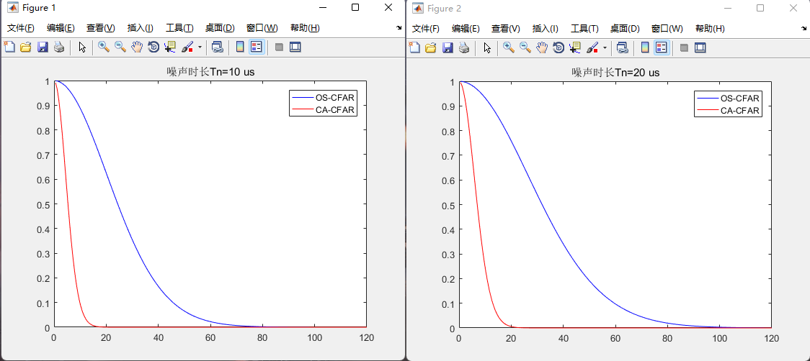

* 间歇采样重复转发协同干扰周期

  > 单干扰机对CA-CFAR检测概率的影响
  >
  > 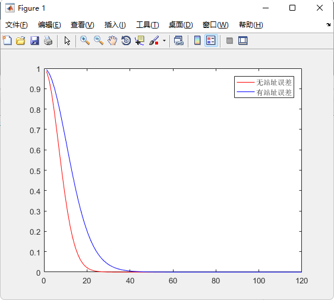
  >
  > 单干扰机对OS-CFAR检测概率的影响 
  >
  > 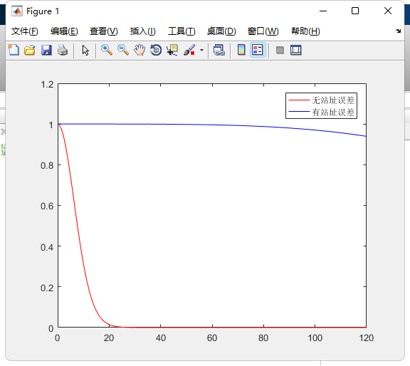
  >
  > 功率协同时对两检测器检测概率的影响 
  >
  > 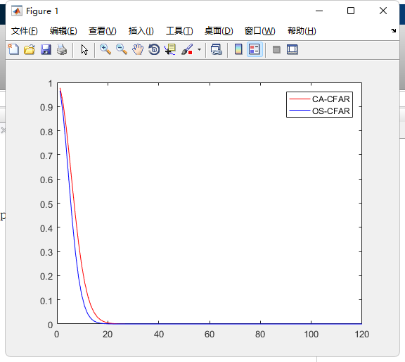
  
* 时间协同干扰对两种检测器的性能影响

  时间协同干扰机分布图如下：

  

  > 不同数量的干扰机检测概率
  >
  > 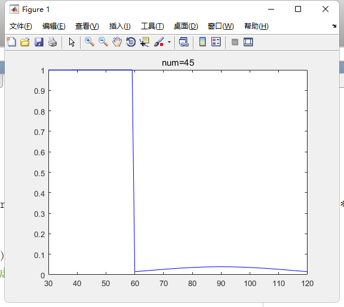
  >
  > 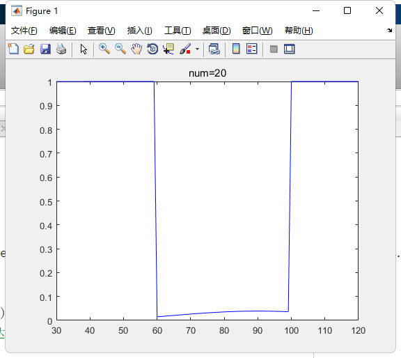
  >
  > 论文中给出的仿真结果
  >
  > 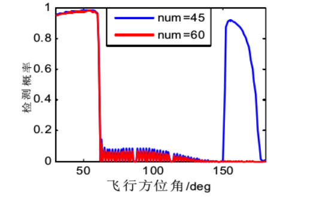

* 不同干扰情形下组网雷达的检测概率分布图

  >论文给出的仿真结果
  >
  >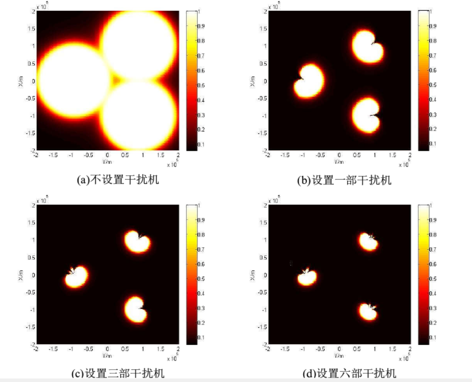
  >
  >不设置干扰机
  >
  >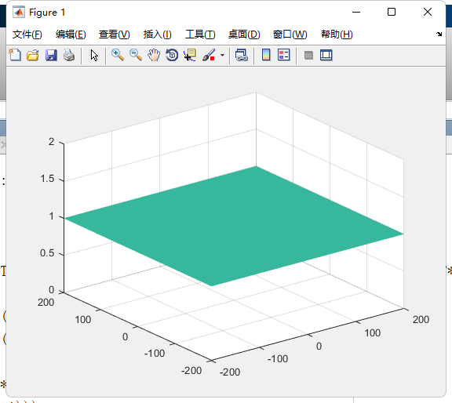
  >
  >设置干扰机
  >
  >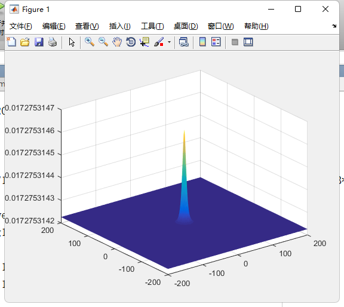

## 2.论文

* 读了一篇中文的关于认知雷达的综述
* 读了一篇英文的关于中断采样转发干扰信号

## 3.下周任务
* 第二第三章仿真部分准备收个尾
* 准备看看有关模型的论文，如对抗生产网络（GAN）的论文
