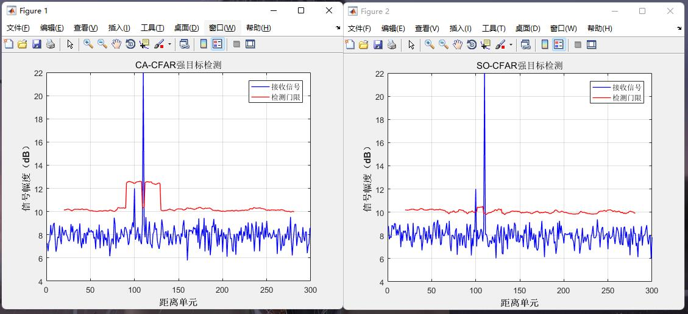
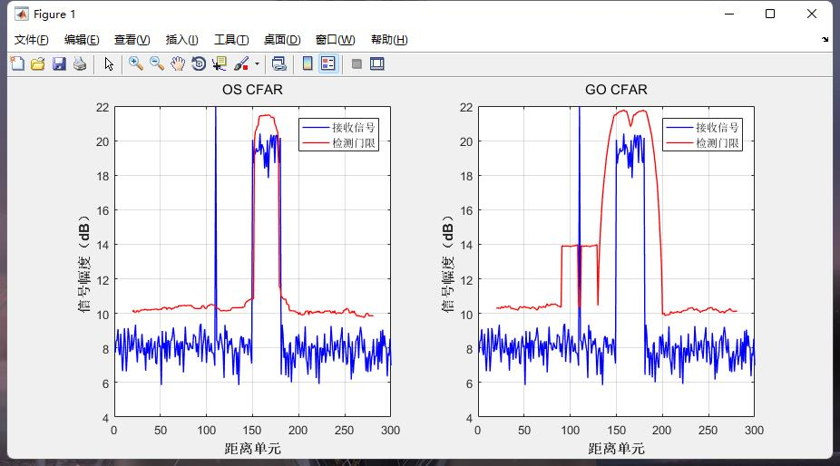

# 本周工作

## 时间：2022.11.28 - 12.2

### 1.恒虚警率检测器(CFAR)复现

CFAR检测器类型：平均单元CA-CFAR、选小SO-CFAR、选大GO-CFAR、有序OS-CFAR

* CA-CFAR：适用于单目标检测
* SO-CFAR：适用于参考单元附近存在单个强目标
* GO-CFAR：适用于非均匀杂波
* OS-CFAR：适用于多目标检测

* 对比实验：

  

  

  

  

  [参考文献1](https://blog.csdn.net/weixin_42686221/article/details/124915956)

  [参考文献2](https://github.com/flappyimi/Radar-Basic-Algorithm/blob/master/EchoProcess/CFAR.m)

### 2.时间协同干扰检测概率随飞机的方位角的变化关系

  

  

### 3.看论文

* ​	Generative Adversarial Nets(GAN) 
* ​    基于博弈论的雷达干扰决策技术研究

  

