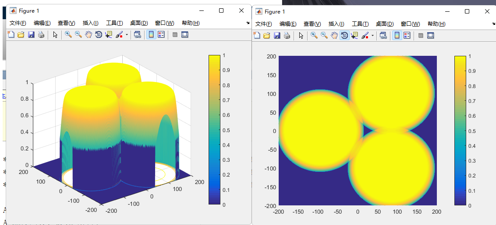

# 本周工作

## 时间：2022.12.5-12.9

### 1.《A Practical Deceptive Jamming Method Based on Vulnerable Location Awareness Adversarial Attack for Radar HRRP Target Recognition》

* 现有的干扰方式主要都是在HRRP上每一个距离单元增加微小扰动，这篇文章主要是在几个甚至一个距离单元增加干扰脉冲来生产对抗性。

* 这个VLA算法是基于一个黑盒模型的，它本质是一个优化约束问题，是利用基于非梯度的QE算法，所以算法的适应范围更广，可以攻击更多的RATR（radar automatic target recognition）模型。

* 为了满足实时性，在上述算法的基础上，设计了一个VLAN网络，解决了QE算法耗时的问题。

* 从硬件的实现来讲，对HRRP的所有距离单元增加微小扰动是不现实的。这个干扰方法只需要在一个距离单元增加干扰脉冲就可以了。虽然硬件很难对一个距离单元进行精准的增加干扰，但是在相邻几个距离单元都有干扰脉冲，干扰的效果基本上一致。

* 数据集有三类组成，分别是An-26、Cessna和Yak-42三种飞机的HRRP。其中，数据集覆盖了飞机的所有方位角。

  

 ### 2. 实验仿真

1.无干扰时雷达探测区域

下一步

