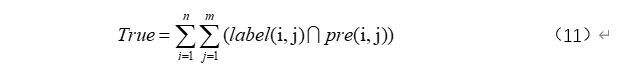
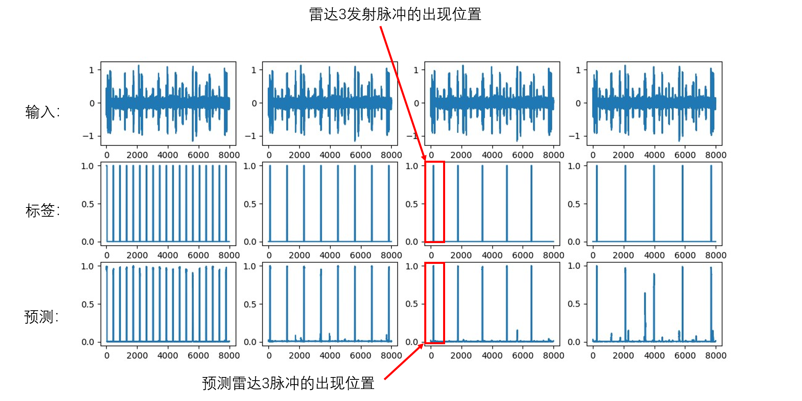
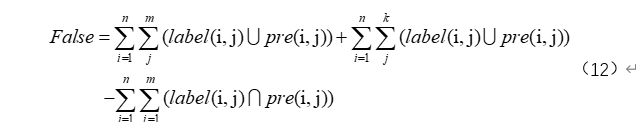
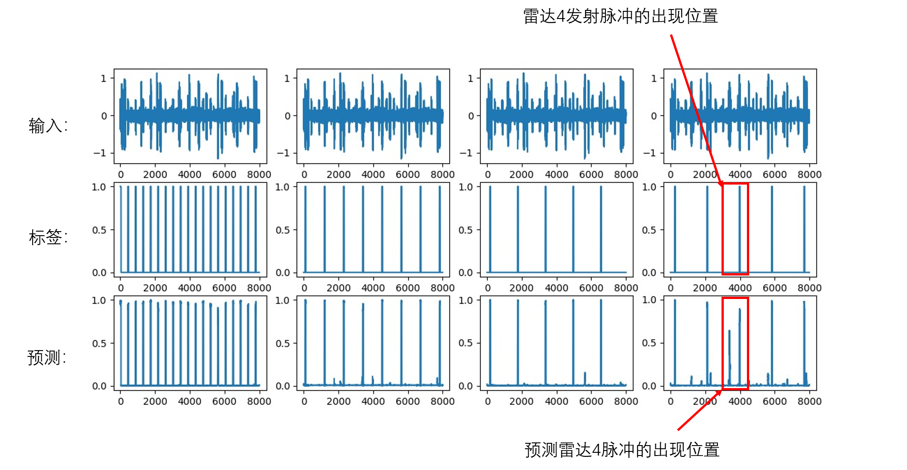
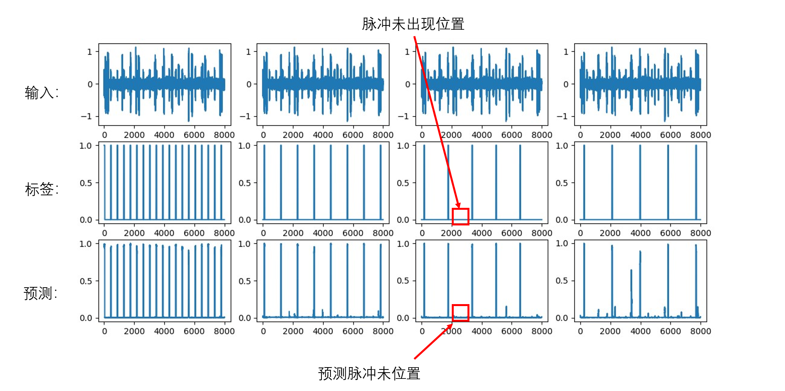
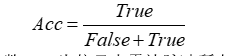

# 最近工作

### 1.对比实验设计

1.将我们的方法和现有研究进行比较，分类精度计算方式如下：

预测正确采样点数量：根据标签中脉冲出现的位置去比较预测结果是否一致。

预测错误采样点数量：标签或者预测结果为脉冲出现位置的采样点之和-预测正确的采样点数量

由于一段信号中大部分采样点都是脉冲未出现位置，所占比例很大，如果将这部分预测结果加入到精度评估中的话，会出现即使分选效果很差，但是分类精度仍然很高的问题，所以在此就不再统计这类采样点分类是否正确。

最后，分类精度计算方式如下：

实验结果如下：

|      | our_method | BLSTM | BGRU  |  DCN  |
| :--: | ---------- | :---: | :---: | :---: |
| Acc  | 0.784      | 0.973 | 0.968 | 0.892 |

