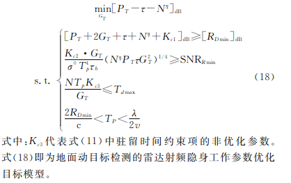
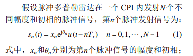
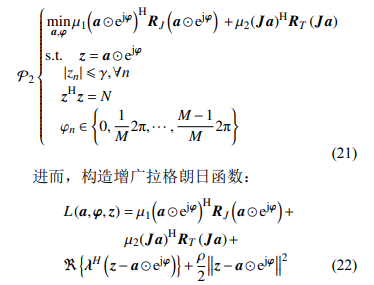
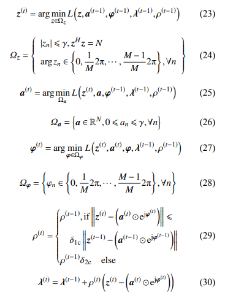

# 本周工作

### 波形优化设计

* 方案1：抗截获方面

  目标函数：

​		优化参数：**雷达工作功率（P）、脉冲压缩前的脉宽（tao）、脉冲发射数量（N）、雷达天线增益（Gt）和脉冲压缩后的脉宽（tao_b = 1/B）**

​		方法：遗传算法

* 方案2：抗干扰方面( 脉间波形幅相联合设计抗欺骗干扰方法 )

  信号模型：

  

  目标函数：

  方法：在交替方向子乘法（ADMM）的基础上设计的非精确交替方向惩罚法 （IADPM）

  
