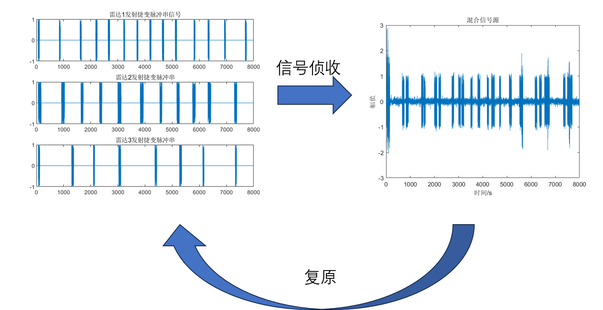
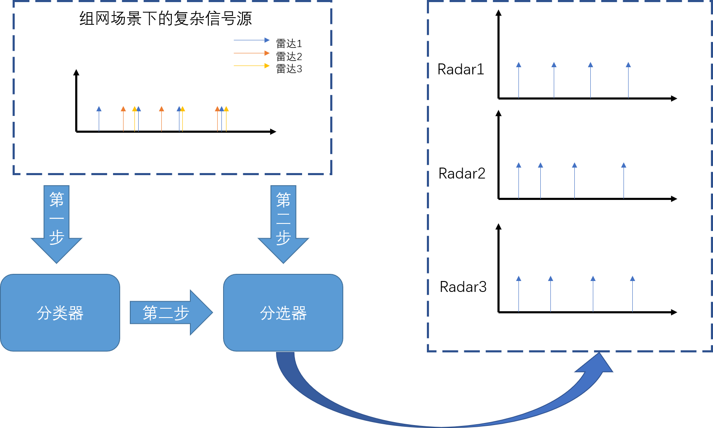
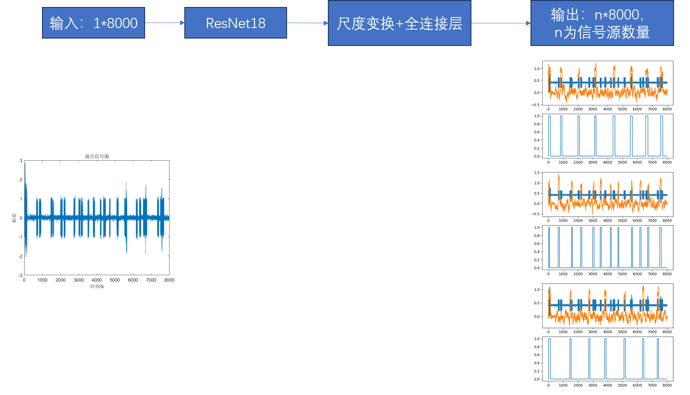
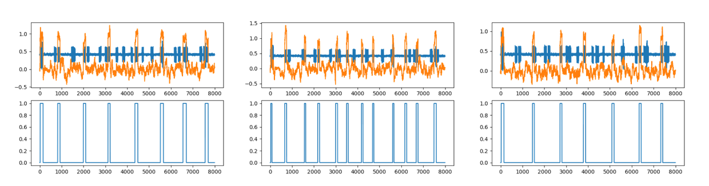
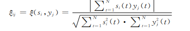

## 最近工作

### 时间：2023.7.18

* 应用背景：在组网场景下，有多部探测雷达在同时工作，战场电磁环境十分复杂。此外，雷达信号参数捷变技术也提升了雷达信号的抗干扰能力，导致利用脉冲描述子进行信号分选更加困难。
* 研究目标：希望利用网络模型实现将复杂的信号中来自同一个雷达的脉冲信号分选出来。

* 总体方案：因为在组网环境中有几个雷达在工作是未知的，所以想先利用网络对**复杂信号源中可能有几个雷达在同时工作**问题作为分类任务，将复杂信号源的分类结果和复杂信号本身作为分选器的输入，然后复原出来自同一个雷达的脉冲信号分选出来。

* 第一步：分类任务

  数据集总共分为6类对应1-6部雷达在同时工作，直接将信号丢入到模型中训练，结果如下：

  | 模型   | 精度   |
  | ------ | ------ |
  | ResNet18 | 81.6% |
  | ResNet18+CBAM | 87% |

* 第二步：分选任务（以三个雷达为例）
  
  由于分选任务主要的特征是信号源的脉冲重复频率（PRI）和脉冲持续时间（PW），也就是**‘脉冲多久出现一次和每次脉冲持续了多长时间’**这个比较感兴趣，所以我以牺牲复杂信号的频域特征为前提，降低了采样频率（fs<2B），减少了采样点，来进可能减少模型的参数量。
  
  此外，标签顺序根据不同雷达的第一个脉冲到达时间进行排序，最先到达的是第一个通道，以此类推。
  
  
  
  结果如下：
  
  上面：**蓝色**是输入信号，**橙色**是预测结果
  
  下面：蓝色是标签
  
  
  
  **相似系数**：描述估计信号与源信号之间的相似性的一种参数，定义如下：
  
  
  
  |                         | 相似系数 |
  | ----------------------- | -------- |
  | 模型预测结果            | 0.3434   |
  
  

