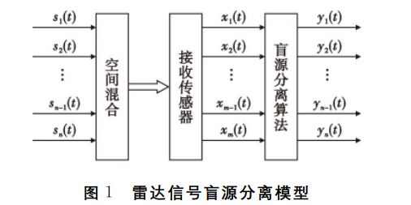
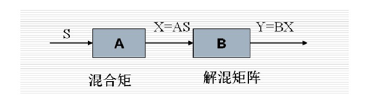
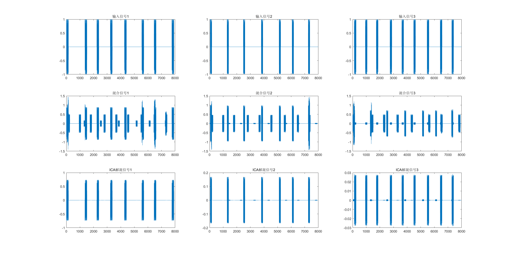
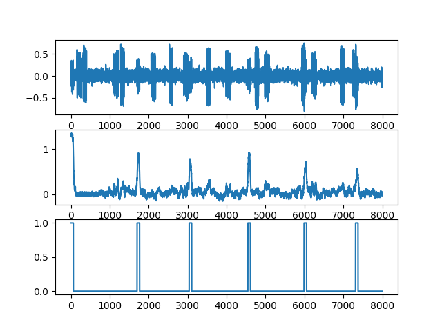
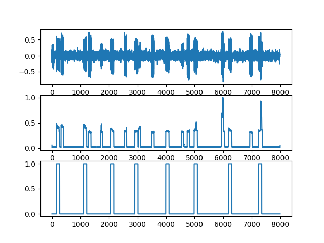
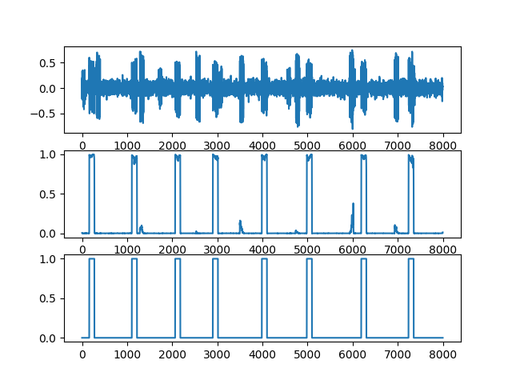

# 最近工作

## 传统盲源信号分离方法：FastICA（独立成分分析）

任务描述：

​                                                                        

 实验：
    

## 基于CNN的信号分选

### ResNet18：

结果：

​                                                   

问题：利用ResNet18提取信号特征，然后用全连接层预测结果，模型深度太深，导致训练过程出现过拟合问题，训练集精度和测试集精度差距过大。

### Unet：

结果：

问题：模型只能学习到脉冲串和噪声之间的区别，无法学习到空间特征，识别来自同一信号源的特征。

### Unet+CBAM：

描述：在Unet的Encoder部分加入卷积注意力模块（CBAM），给不同**空间**和**通道**添加权重。

结果：

### 实验结果

数据集构成：训练集4000条，测试集400条，脉冲源的起始到达时间[0,4e-4,8e-4]（单位：秒），脉冲重复时间在[2e-3,4e-3]（单位：秒）之间随机生成，捷变信号抖动率设置为0.2，脉冲持续时间在[1e-4,3e-4]（单位：秒）之间随机生成，采样时间为0.02秒，采样点8000个。

指标：相似系数是一种描述估计信号与源信号之间的相似性的参数。

|        | 信号源1 |信号源2|信号源3|
| :----: | :------: |:------:|:------:|
| ResNet18 | / |/|/|
| ResNet18+CBAM | 0.8 |0.65|0.65|
| Unet | / |0.62|/|
| Unet+CBAM | 0.96 |0.95|0.95|

### 后续计划

1.完成针对组网雷达的多参数寻优。

