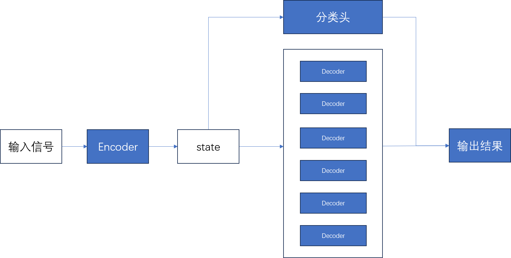

## 最近工作

#### 1.攥写论文的中文框架

其中以深度学习展开工作的相关论文已经更新在git上了。

#### 2.修改网络模型

原先：根据分类结果设计拥有不同数量的解码器模型。

现在：想要将所有任务通过一个模型解决，具体思路：根据输入信号中可能存在最多的信号源数量去设计解码器数量，将解码器的数量固定（**将模型的输出固定**）。假设输入信号中最多存在6个独立的信号源，那么模型的结构就是一个编码器，6个解码器。然后在编码器的输出接入一个分类头来预测输入信号中存在的信号源数量，根据分类头的结果来调整输出几个编码器的分选结果（**选择模型输出的有用部分**）。

