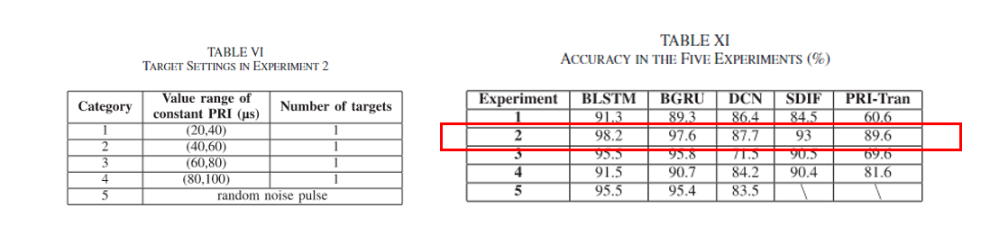

# 最近工作

论文缺少baseline，针对该问题，最近在复现一篇利用BLSTM实现雷达信号分选的方法。

论文：[A Radar Signal Deinterleaving Method Based on Semantic Segmentation with Neural Network ](https://ieeexplore.ieee.org/document/9999169)

### 1.实验设计

该论文主要设计了5种不同的实验，然后我将针对第二个实验条件进行复现。**左图**主要展示了四个雷达采用不同大小的PRI进行工作时，每个雷达发射的脉冲个数未知（论文好像没说），所以我将每个雷达都发射50个脉冲，然后将所以脉冲的到达时间混叠在一起，计算当前脉冲和前一个脉冲之间的到达时间差作为特征输入到BLSTM中进行分类，预测脉冲属于哪个雷达。**右图**红色部分是在该实验条件下分类精度。

当前进展：数据集和模型（根据论文给定的参数）都已经设计好了，分类结果很差。（已解决）

问题：可能是每个雷达的脉冲的数量太少了。

|      | BLSTM |
| :--: | :---: |
| acc  | 0.973  |

## 2.实验部分介绍

由于我们的方法可以对不同雷达数量组成的脉冲信号进行分选，所以我想要在论文实验部分分两部分介绍。

**第一部分**，先介绍我们网络在不同雷达数量下分选的效果（自己的提出的量化指标达到的效果）。

**第二部分**，只针对四个雷达的组成的信号下分选效果然后和上述实验进行对比分析。
