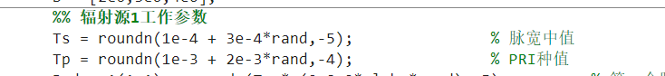
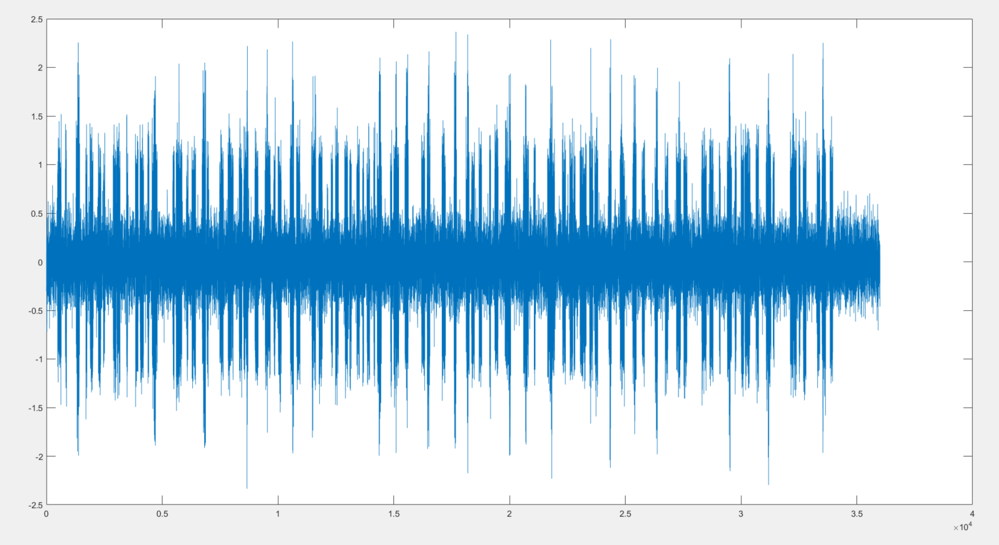
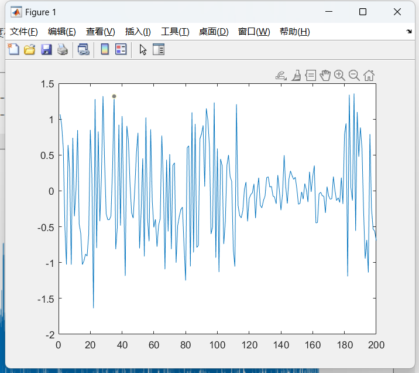
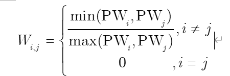

## 周报 

### 场景：辐射源参数相近

* 模拟了三个辐射源场景，每个辐射源的工作参数在同一个参数区间（脉冲宽度在[0.1ms，0.4ms]，脉冲重复间隔在[1ms，3ms]）内随机挑选，再经过捷变调制（捷变率为0.2）生成接收信号，每段信号存在120个脉冲；

* 

* 

* 然后对接收信号进行脉冲测量（得到每个脉冲宽度)，再利用一个窗口（Window=200）从每个脉冲上升沿开始截取时域信号作为**每个脉冲的节点特征**,窗口大小要大于最大的PW所需要的采样点（每个脉冲的脉宽不同，时域的采样长短不一，通过一个等长的窗口去截取时域信号目的就是做到数据等长，方便后面训练）；

  
  
* 根据每个脉冲测量得到的脉冲宽度计算邻接矩阵（120*120），计算方式如下；

  

* 重复上面操作，生成1200条数据，每条数据大小为（节点大小:120 * 200，邻接矩阵大小：120 * 120）1000条作为训练集，200条作为测试集，然后利用图注意力网络（GAT）进行训练。
* 分类精度：0.34（结论：不具备分选能力）

### 场景：辐射源参数不相近

* 三个辐射源的工作参数在不同一个参数区间选取
  * **区间1**：脉冲宽度[0.1ms，0.2ms]，脉冲重复间隔[1ms，2ms]；
  * **区间2**：脉冲宽度[0.2ms，0.3ms]，脉冲重复间隔[2ms，3ms]；
  * **区间3**：脉冲宽度[0.3ms，0.4ms]，脉冲重复间隔[3ms，4ms]；

* 分类精度
  * GAT：79%
  * MLP+GAT：92%（节点特征维度（200）太大了,先通过MLP对节点时域特征进行特征提取实现降维（18）,再通过图注意力网络进行学习分类，提升了13%的分类精度）

