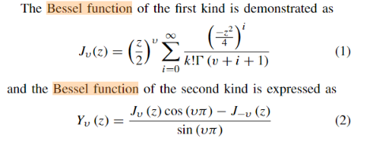
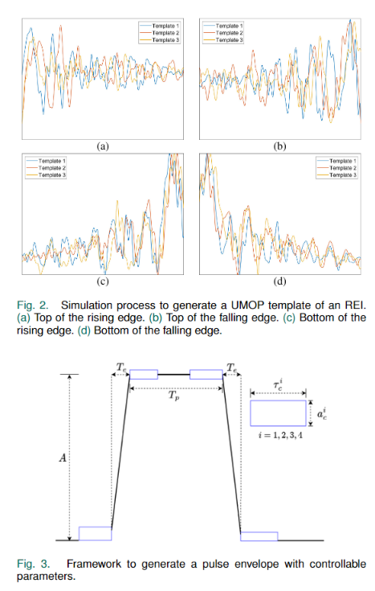

### 周报

问题：利用图网络进行分选时，可能过分依赖边特征（脉冲宽度的相似程度），辐射源的工作参数相近时，节点特征（脉冲时域特征）的识别能力不足，分选能力不足，导致任务可能过于简单，为此参考一篇雷达辐射源识别的文章，它可能是参考了通信领域中射频指纹的任务，引入了脉冲无意调制特征来实现辐射源识别。因此，我们希望将这种脉冲无意调制特征（Unintentional modulation on pulse，UMOP）添加到脉冲中，来增加节点特征的区分度。

**脉冲无意调制特征**是根据发射器的硬件差异引起的非故意调制，每个辐射源的无意调制特征是不同的。该特征的表现形式主要包括了俩个部分频率稳定性和**包络振幅在脉冲上升和下降边缘附近的波动**。而频率稳定性的提取不仅十分复杂， 并且考虑到不同的工作模式和灵活的传输参数，频率稳定性不会表现出固定模式。相比之下包络振幅的波动不仅容易提取，而且振幅的波动是唯一的。因此利用包络振幅的指纹来模拟脉冲的无意调制特征。

使用**贝塞尔函数**来模拟幅值的急剧变化。基于第一类贝塞尔公式和第二类贝塞尔公式，改变不同的V值，得到脉冲上升和下降边缘附近的波动模板，组合得到不同辐射源的UMOP。

将生成的UMOP加入到脉冲中，增加脉冲信号的时域特征，尝试解决针对辐射源的工作参数相近时分选能力不足的问题。

**后续**：可以增加硬件验证实验，利用USRP来模拟**多发单收**的场景，进行算法验证。

