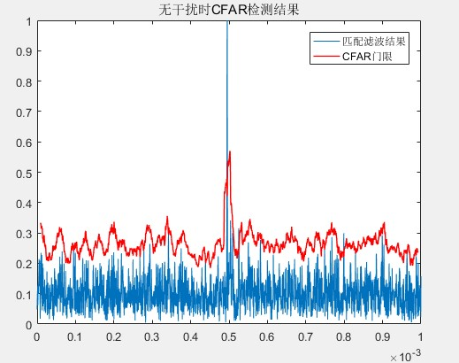
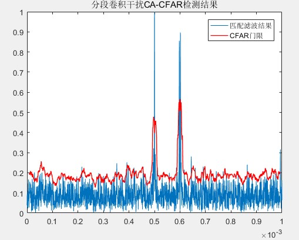
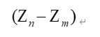

# 本周汇报

## 工作进展1--单节点LD信号数据集

### 1.1 线性调频体制(LFM)

## 1.2 步进频体制(SFW)

## 工作进展2--同源检测

### 2.1 算法流程

 **多个雷达量测值--->数据对准--->最近关联--->基于位置信息的点迹关联--->基于速度信息的点迹关联--->真实目标  **

### 2.2 场景设置

真实目标数量为1，坐标位置：**[70,60]**km,实际速度矢量为**[-100,-50]**m/s,。

有源假目标数量为1，欺骗速度在**-50m/s**到**-500m/s**均匀分布，欺骗距离为**200m**到**2000m**，变化间隔为200m。

通过**5000**次**Monto Carlo**仿真统计真目标和有源假目标的鉴别概率。

 ### 2.3 基于位置信息的点迹关联

选择两雷达之间的马氏距离作为假设检验量，马氏距离为

其中为任两雷达量测值之差，其满足均值为0，方差为，马氏距离服从X^2分布，只有所有关联的量测值通过检测，才认为是真目标。

#### 实验结果

### 2.4 基于速度信息的点迹关联

在位置信息的点迹关联检测的基础上，两两进行速度信息融合，根据速度差的误差协方差矩阵，计算马氏距离作为假设检验量。

#### 实验结果

